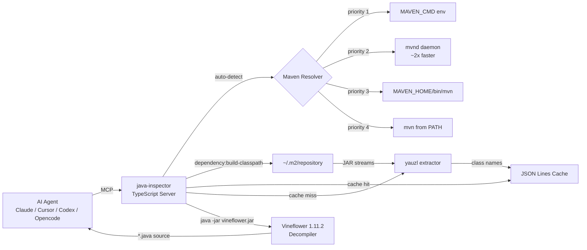
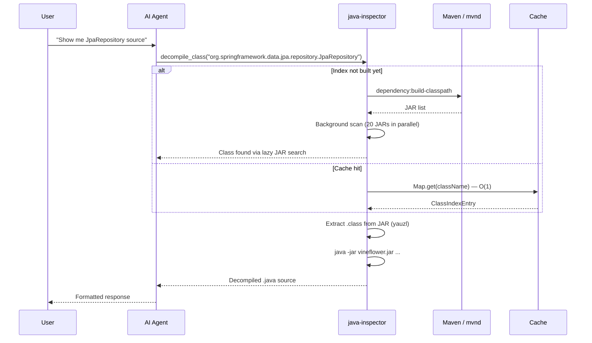
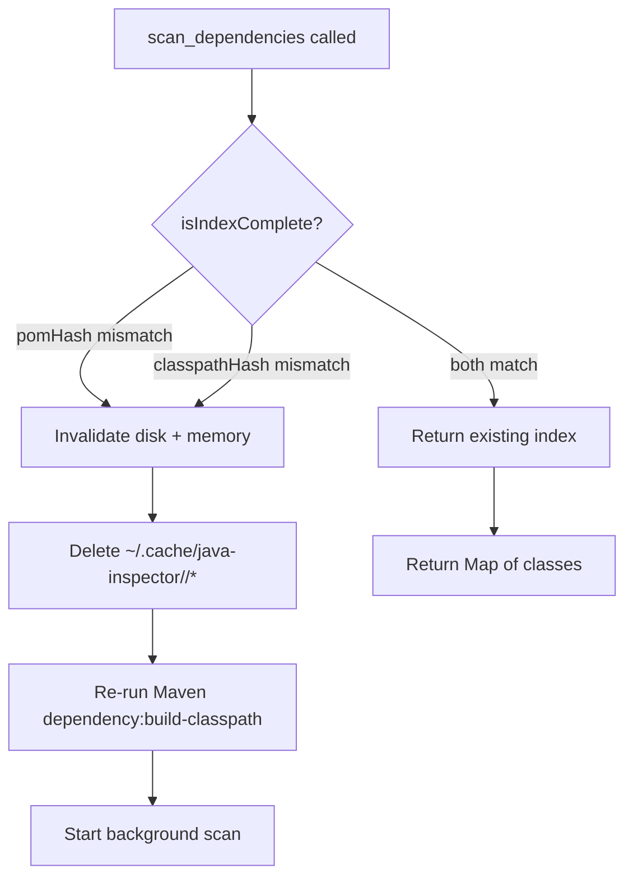

# Java Inspector

> **Decompile Maven dependencies into readable Java source — directly inside your AI agent.**

[](https://www.npmjs.com/package/@mustafagoksever/java-inspector)
[](LICENSE)

---

## What is this?

AI editors can't read compiled `.class` files. Ask *"How does `JpaRepository` work?"* and the agent hallucinates.

**Java Inspector** is an MCP server that exposes the internals of your project's Maven dependencies (Spring, Hibernate, Jackson, Micrometer, etc.) as decompiled Java source code. Zero configuration — just point your agent at it.

### Supported operations

| Tool | What it does |
|------|--------------|
| `scan_dependencies` | Kicks off a background scan of every JAR on the Maven classpath. Call again to poll progress. |
| `decompile_class` | Returns the **full Java source** (method bodies and all) via Vineflower. Optionally extract a single method by `methodName`, or paginate with `offset`/`limit`. |
| `analyze_class` | Returns the **structural signature** — fields, methods, constructors, inheritance — via `javap`. No method bodies. |
| `search_class` | Fuzzy-find classes by partial name (e.g. `"ObservationRegistry"`). |
| `get_inheritance_tree` | Walks the superclass chain up to `java.lang.Object`. |

### Response formats

Every tool accepts a `format` parameter (`text` | `json` | `toon`). Default is `text`.

| Format | What you get | Best for |
|--------|-------------|----------|
| `text` | Human-readable markdown, tables, code blocks | Reading by LLMs and humans |
| `json` | Pure `structuredContent` — no text wrapper | Programmatic consumption, piping to other tools |
| `toon` | [Token-Oriented Object Notation](https://github.com/toon-format/toon) — compact, schema-aware text | LLM prompts where token count matters (~40% fewer tokens than JSON) |

**`json`** strips the text wrapper and returns only the structured payload.  
**`toon`** encodes the same payload via `@toon-format/toon`, giving you YAML-like readability with CSV-like compactness for uniform arrays.

---

## Architecture



### Why JSON Lines?

Traditional JSON caches rewrite the entire file on every batch — O(n²) overhead for large projects. We use **append-only JSON Lines**:

- **Crash-safe**: each line is independent; a truncated final line is skipped on reload.
- **Fast startup**: the server replays the JSONL into an in-memory `Map<string, ClassIndexEntry>` on launch.
- **Low memory**: ~35 MB RAM for 100,000 classes.

### Cache layout

```
~/.cache/java-inspector/<project>_<hash>/
├── classpath.json           # pomHash + jarPaths[] + classpathHash + timestamp
├── class-index.jsonl        # Append-only ClassIndexEntry batches
├── scan-state.json          # jarCount, processedJars[], isComplete
├── server-<pid>.log         # Per-process append-only logs (multi-process safe)
├── write.lock               # Cross-process lock for JSONL / state writes
├── scan.lock                # Cross-process lock for scan lifecycle
└── decompile-cache-vineflower/  # Cached .java sources
```

---

## Quick Start

Add to your MCP client config:

### Claude Desktop

Edit `%APPDATA%\Claude\claude_desktop_config.json`:

```json
{
  "mcpServers": {
    "java-inspector": {
      "command": "npx",
      "args": ["-y", "@mustafagoksever/java-inspector"]
    }
  }
}
```

### Cursor

`Settings` → `MCP Servers` → Add:

```json
{
  "mcpServers": {
    "java-inspector": {
      "command": "npx",
      "args": ["-y", "@mustafagoksever/java-inspector"]
    }
  }
}
```

### Codex

Edit `%APPDATA%\Codex\config.json`:

```json
{
  "mcpServers": {
    "java-inspector": {
      "command": "npx",
      "args": ["-y", "@mustafagoksever/java-inspector"]
    }
  }
}
```

### Opencode

Edit `%APPDATA%\opencode\config.json`:

```json
{
  "mcp": {
    "devtools": {
      "type": "local",
      "command": [
        "npx",
        "-y",
        "chrome-devtools-mcp@latest"
      ]
    },
    "java-inspector": {
      "type": "local",
      "command": [
        "npx",
        "-y",
        "@mustafagoksever/java-inspector"
      ]
    }
  }
}
```

Restart your editor and ask: *"Show me the source of `ObservationRegistry`"*

That's it. No `JAVA_HOME` tweaks. No manual decompiler download. The server ships the ~1.8 MB Vineflower JAR inside the package.

---

## Workflow



---

## Performance

Real numbers from a **Spring Boot + Vaadin** project (144 dependencies, 17,405 classes):

| Phase | Cold start | Warm cache |
|-------|-----------|------------|
| Maven classpath resolve | 5–10 s | — |
| Background JAR index | 20–30 s | — |
| Per-class lookup | 2–5 s | **< 1 ms** |
| Fuzzy search | — | **~30 ms** |
| Vineflower decompile (first) | ~2 s | — |
| Vineflower decompile (cached) | — | **< 100 ms** |

**First tool call** lands in ~10 seconds (classpath resolve + scan kickoff). **Everything after that** is effectively instant.

**Multi-process safety**: Two-tier cross-process locking via `proper-lockfile` ensures that if multiple MCP server instances target the same project, only one scan runs at a time. The other instances receive a graceful `in_progress` response instead of duplicating work.

---

## Cache invalidation



Invalidation triggers:

1. **Module `pom.xml` changes** — `pomHash` mismatch.
2. **Parent POM / dependency-management changes** — `classpathHash` mismatch.
3. **Manual** — call `scan_dependencies` with `forceRefresh: true`. This force-releases cross-process locks and wipes the cache directory before restarting.

---

## Platform Support

| OS | Command |
|----|---------|
| Windows | `npx -y @mustafagoksever/java-inspector` |
| Linux | `npx -y @mustafagoksever/java-inspector` |
| macOS | `npx -y @mustafagoksever/java-inspector` |

**Requirements:** Node.js ≥ 16, Java runtime, Maven (or `mvnd` for faster resolves).

---

## Environment variables

| Variable | Effect |
|----------|--------|
| `JAVA_HOME` | Locates `java` and `javap`. |
| `MAVEN_HOME` | Locates `mvn` / `mvn.cmd`. |
| `MAVEN_CMD` | Override executable entirely — e.g. `mvnd`, `mvnw`, or a full path. |
| `MAVEN_REPO` | Overrides `~/.m2/repository`. |
| `DECOMPILER_PATH` | Use a custom Vineflower JAR instead of the bundled one. |
| `NODE_ENV=development` | Enables verbose `server.log` output. |

---

## Installation alternatives

**Zero-setup (recommended)**
```bash
npx @mustafagoksever/java-inspector
```

**Global install**
```bash
npm install -g @mustafagoksever/java-inspector
java-inspector start
```

**Build from source**
```bash
git clone https://github.com/mustafagoksever/java-inspector.git
cd java-inspector
npm install
npm run build
```

---

## Troubleshooting

### Log Files

All logs are stored in the cache directory under your user home:

```
~/.cache/java-inspector/<project>_<hash>/server-<pid>.log
```

**Viewing logs while connected:**

```powershell
# PowerShell
Get-Content ~/.cache/java-inspector/<project>_<hash>/server-<pid>.log -Wait -Tail 20

# Unix/macOS
tail -f ~/.cache/java-inspector/<project>_<hash>/server-<pid>.log
```

Log files are **cleared when cache is invalidated** (`forceRefresh: true` or hash mismatch).

| Tag | Description |
|-----|-------------|
| `[SERVER]` | Server startup/shutdown |
| `[AUTO-SCAN]` | Automatic scan on startup |
| `[MAVEN]` | Maven command resolution & classpath building |
| `[SCAN]` | Background JAR scanning |
| `[JAVAP]` | `javap` class analysis |
| `[DECOMPILE]` | Vineflower decompilation |
| `[TOOL:<name>]` | Tool call entry/exit with duration |
| `[CACHE]` | Cache invalidation & state |
| `[LOCK]` | Cross-process lock acquire/release/compromise |

### Common Issues

**"command not found" error**
- Ensure Node.js and npm are in your PATH.

**Maven not found**
- Set `MAVEN_HOME` environment variable or ensure Maven is in your PATH.
- Try using `mvnd` (Maven Daemon) for ~2x faster resolves.

**Lock timeout errors**
- If a process was killed with SIGKILL while scanning, locks become stale after 60 seconds.
- Another process can then acquire the lock. No action needed unless the problem persists.

**Cache problems**
- Call `scan_dependencies` with `forceRefresh: true` to clear cache and restart.

---

## Technical stack

| Layer | Technology |
|-------|------------|
| Language | TypeScript 5.7 |
| Runtime | Node.js 16+ |
| Protocol | Model Context Protocol (MCP) |
| Decompiler | Vineflower 1.11.2 (bundled) |
| JAR reader | yauzl (streaming, lazy entries) |
| Build tool | tsc |
| Package manager | npm |
| License | Apache-2.0 |

---

## License

Apache-2.0
